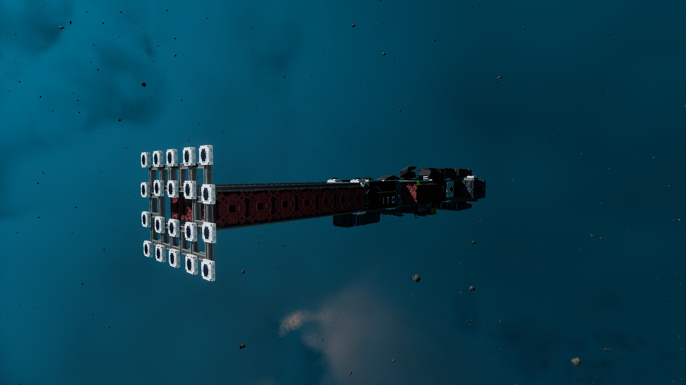

# itc-collision-avoidance

### Instructions
- Create an Off/On Button to turn on autopilot. Name it "AP" with 1 value for On and 0 for Off.
- On your FcuForward lever: Rename LeverCenteringSpeed to "Cruise". (Note: this is a common button on most ships. It may already be setup.)
- On all Rangefinders: Rename RangeFinderDistance to "RT". Leave RangeFinderOnState as-is. Ensure RangeFinderSearchLength is set to 1000.
- Optionally create warning light(s) or audibles to be triggered by "wl". wl will be 1 during avoidance manuevers.

### Rangefinder Array
The key part of an autopilot build is your Rangefinder array. You must have full coverage of your ship in the direction of movement. Good density should be 96cm between RF beams to decrease the probabilty of getting clipped.



### Avoidance manuevers
The avoidance manuever is simple. It stops forward movement, sets full reverse thrust, and sets full right movemennt. The purpose of this is to reduce speed immediately to provide time for avoidance. Moving laterally maintains your current heading for the most part.

### Detection Speed
During autopilot flight, detection speed is 0.2 seconds. At 150m/s and 1km scan range, ensure your ship is capable of breaking to a full stop within 800 meters. Use retro thrusters if needed.

### Final Notes
Avoid making course corrections while under speed as your momentum may drift you into an object outside of your range finder array. Ensure you are stopped or have sufficent clear space. Do not make course corrections in the fog.

### Release of Liability
Due to how Rangefinders are built and mounted on hardpoints, it may be impossible to obtain 100% sensor cover of a ship's silhouette. There may also be asteroid or ship hitbox loading issues. Always keep both hands on the wheel and be prepared to take control at any time. ITC and/or the author is not responsible for damage, loss of ship, and/or life while using itc-collision-avoidance.

### Code comments
```
:AP = On/Off Button
:RT = RangeFinderDistances
:RangeFinderOnState = Toggle for Rangefinders
:wl = Warning Light/Warning Trigger
ol = off_line
bal = begin_autopilot_line
bf = begin_flight_line
bsla = begin_scan_line_in_flight
bslb = begin_scan_line_in_evade
el = evade_line
r = reset_line
s = scan_range
```